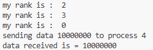

# Chapter 4 

### Table of Contents
* [1. helloworld_MPI](#1-helloworld_mpi)
* [2. broadcast](#2-broadcast)
* [3. scatter](#3-scatter)
* [4. gather](#4-gather)
* [5. alltoall](#5-alltoall)
* [6. reduction](#6-reduction)
* [7. pointToPointCommunication](#7-pointtopointcommunication)
* [8. deadLockProblems](#8-deadlockproblems)
* [9. virtualTopology](#9-virtualtopology)

---

### 1. helloworld_MPI
* **What I Learned:** I learned the foundational setup of an MPI (Message Passing Interface) environment. This script introduces the SPMD (Single Program, Multiple Data) model, where multiple instances of the same script are launched simultaneously, each identifying itself through a unique rank within a shared communicator group.
* **How it Executes:** When executed via `mpiexec`, the MPI environment clones the script across the specified number of CPU cores. Each instance runs the code independently, fetches its unique rank from the communicator, and prints a greeting message to confirm it is part of the parallel network.
* **Code Understanding:** - `MPI.COMM_WORLD` represents the default group containing all processes currently running in the job.
  - `comm.Get_rank()` retrieves the unique integer ID of the process (starting from 0), which is essential for directing specific workloads.
* **End Use:** This is used as a standard diagnostic tool to verify that an MPI cluster or multi-core environment is correctly configured and that all nodes can communicate successfully.
* **Short Summary:** A basic entry-level script that demonstrates the SPMD model by having multiple processes report their presence and unique identifiers.
* - **Advantages:** Extremely simple to implement and the perfect way to test environment connectivity before running heavy scripts.
  - **Disadvantages:** Does not involve any actual data exchange or synchronization between the processes.
* **Output:** 

### 2. broadcast
* **What I Learned:** I learned the "One-to-All" communication pattern. This is the primary mechanism used when a single source process (the Root) needs to share a specific piece of data with every other process in the communicator group simultaneously.
* **How it Executes:** The Root process (rank 0) initializes a variable with a value. All other processes start with the variable as `None`. After the `.bcast()` call is triggered, the value from the Root is copied directly into the memory space of every other rank in the network.
* **Code Understanding:** - `comm.bcast(data, root=0)` is a collective call that handles both sending (for the root) and receiving (for all other workers) in a single optimized line of code.
* **End Use:** Ideal for distributing configuration parameters, initial weights in a distributed machine learning model, or global constants that all workers need to access.
* **Short Summary:** Demonstrating how to efficiently synchronize a single piece of information across an entire parallel network in one step.
* - **Advantages:** Much faster and more network-efficient than manually sending the same data to each process one by one using a loop.
  - **Disadvantages:** Can lead to unnecessary memory usage if the dataset is large and only a few processes actually require the data.
* **Output:** 

### 3. scatter
* **What I Learned:** I learned how to divide a large dataset and distribute unique chunks to different workers. Unlike broadcasting, scattering ensures that each process receives a different, unique segment of the original data array for processing.
* **How it Executes:** The Root process holds a primary list or array. The `.scatter()` function chops this list into equal parts based on the total number of processes and sends the $i$-th element to the $i$-th rank for local execution.
* **Code Understanding:** - `comm.scatter(array, root=0)` performs the distribution logic. For this to work without errors, the size of the array must match the total number of processes (`size`).
* **End Use:** This is essential for "Data Parallelism" where a large task (like a massive calculation) is split up so that each core works on a completely different section of the data.
* **Short Summary:** This script demonstrates the distribution of a workload by partitioning an array across all available parallel processes.
* - **Advantages:** Maximizes efficiency and prevents redundant processing by giving each worker a unique task segment.
  - **Disadvantages:** The input array size must be perfectly divisible by the number of processes, or the script will encounter a runtime error.
* **Output:** 

### 4. gather
* **What I Learned:** I learned the "All-to-One" pattern, which acts as the functional inverse of Scatter. It is utilized to collect individual results from all worker processes and combine them into a single centralized list on the Root process.
* **How it Executes:** Each process performs a local calculation (like squaring its own rank). Then, the `.gather()` method is called, which pulls these individual values back to rank 0, placing them in an array in the order of the ranks that sent them.
* **Code Understanding:** - `comm.gather(data, root=0)` collects the values. On rank 0, the result is a compiled list; on all other worker ranks, the result is usually returned as `None`.
* **End Use:** Used at the final stage of a parallel computation to compile results, such as gathering local sums to calculate a global total or merging processed image tiles.
* **Short Summary:** Demonstrates the aggregation of distributed data back into a single centralized process for final reporting or storage.
* - **Advantages:** Simplifies the collection of results significantly without needing to write multiple individual send and receive calls.
  - **Disadvantages:** If the gathered data is massive, the Root process (Rank 0) might run out of RAM while trying to hold all the combined data.
* **Output:** 

### 5. alltoall
* **What I Learned:** I learned the "Many-to-Many" communication pattern. This is a complex exchange where every single process sends a unique piece of data to every other process and receives a unique piece of data from them in return.
* **How it Executes:** Every process prepares a specific array of data. After the `.Alltoall()` command, the $j$-th element of process $i$ is sent to process $j$, effectively performing a matrix-like transpose across the entire process network.
* **Code Understanding:** - `comm.Alltoall(sendbuf, recvbuf)` facilitates a total exchange of data, ensuring that every node communicates with every other node in the group.
* **End Use:** Heavily used in advanced scientific algorithms like Fast Fourier Transforms (FFT) or parallel sorting where every node requires specific information from every other node.
* **Short Summary:** A powerful synchronization script showcasing a total, multi-directional exchange of data across the entire communicator group.
* - **Advantages:** Replaces the need for $N^2$ individual messages with a single, highly optimized collective call managed by the MPI engine.
  - **Disadvantages:** High network overhead; it can cause significant performance slowdowns if the number of processes or the data size is very large.
* **Output:** 

### 6. reduction
* **What I Learned:** I learned how to perform global mathematical operations (like Sum, Max, or Min) across distributed data. This technique combines the process of gathering and computation into one high-speed step.
* **How it Executes:** Each process generates a local value. The `.Reduce()` function collects these values to the Root and applies a specified mathematical operator (like `MPI.SUM`) to them as they are being gathered.
* **Code Understanding:** - `op=MPI.SUM` instructs the MPI engine to add the values together during the collection process, returning only the final result to the root.
* **End Use:** Standard for calculating global statistics, such as finding the average temperature from a million sensors or identifying the maximum value in a massive distributed dataset.
* **Short Summary:** Showcasing an efficient way to perform global mathematical aggregations across multiple CPU cores without manual loops.
* - **Advantages:** Extremely memory efficient because it doesn't store all individual values; it only maintains the single running result.
  - **Disadvantages:** You are strictly limited to the predefined operations supported by MPI (Sum, Product, Max, Min, etc.).
* **Output:** 

### 7. pointToPointCommunication
* **What I Learned:** I learned how to handle direct "One-to-One" messages. This is the most granular form of communication where a specific sender process targets one specific receiver process.
* **How it Executes:** The script uses `if` statements to define specific behaviors for individual ranks. For example, Rank 0 sends data to Rank 4, and Rank 1 sends data to Rank 8. The receiving ranks must be ready with a matching `.recv()` call.
* **Code Understanding:** - `comm.send(data, dest=...)` initiates the transfer to a specific target.
  - `comm.recv(source=...)` is a blocking call that forces the receiver to wait until the expected data actually arrives.
* **End Use:** Used for custom communication protocols, master-worker architectures, or passing specific signals between adjacent nodes in a grid.
* **Short Summary:** Demonstrates targeted, direct communication between specific process pairs without involving any other processes in the group.
* - **Advantages:** Offers maximum control over exactly which process gets what data and at what precise moment.
  - **Disadvantages:** High risk of "Deadlocks" if the send/receive calls are not perfectly matched and ordered across the script.
* **Output:** 

### 8. deadLockProblems
* **What I Learned:** I learned about the biggest danger in parallel programming: the **Deadlock**. This occurs when two or more processes are trapped waiting for each other to send data, causing the program to freeze forever.
* **How it Executes:** In this script, two processes (Rank 1 and 5) both try to `recv()` data before they ever call `send()`. Since both are in a blocking wait state, neither ever reaches the send line, and the code hangs indefinitely.
* **Code Understanding:** - The execution order of `comm.send` and `comm.recv` is critical. To avoid this, one process must be programmed to send first while the other is set to receive first.
* **End Use:** This script serves as a vital "Negative Example" to teach developers how to identify and avoid blocking the execution flow in complex parallel systems.
* **Short Summary:** A critical lesson in process synchronization, highlighting how incorrect communication ordering can permanently freeze a parallel application.
* - **Advantages:** Teaches essential debugging and architectural skills required for high-performance computing.
  - **Disadvantages:** If not handled properly, deadlocks can waste massive amounts of computational time and system resources.
* **Output:** 

### 9. virtualTopology
* **What I Learned:** I learned how to organize processes into a logical, spatial shape, specifically a 2D Grid (Cartesian Topology). This allows processes to be managed as if they represent a physical coordinate system.
* **How it Executes:** The script calculates a grid size (Rows x Columns). It uses `Create_cart` to map ranks to X,Y coordinates and then uses `Shift` to automatically find neighboring processes (Up, Down, Left, Right) relative to its position.
* **Code Understanding:** - `comm.Create_cart` creates the logical grid structure. 
  - `periods=(True, True)` allows the grid to be "periodic," meaning the top edge connects to the bottom and the left edge connects to the right (wrap-around).
* **End Use:** Heavily used in weather forecasting, fluid dynamics, and physics simulations where each process is responsible for one "tile" of a larger map.
* **Short Summary:** Demonstrates an advanced method for mapping processes into a spatial structure to simplify neighbor-to-neighbor communication.
* - **Advantages:** Makes the logic for neighbor-based calculations much cleaner and easier to write than using manual rank math.
  - **Disadvantages:** Adds an extra layer of complexity to the initial setup of the communicator group.
* **Output:** 

