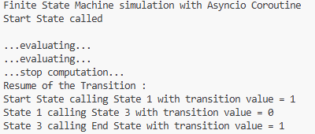
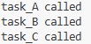

# Chapter 5 

### Table of Contents
* [1. asyncio_and_futures](#1-asyncio_and_futures)
* [2. asyncio_coroutine](#2-asyncio_coroutine)
* [3. asyncio_event_loop](#3-asyncio_event_loop)
* [4. asyncio_task_manipulation](#4-asyncio_task_manipulation)
* [5. concurrent_futures_pooling](#5-concurrent_futures_pooling)

---

### 1. asyncio_and_futures
* **What I Learned:** I learned how to utilize Python's modern `asyncio` library to manage concurrent background tasks (coroutines) and how to handle `Futures`. I also learned how to dynamically accept input parameters directly from the terminal using `sys.argv`.
* **How it Executes:** When the script is run from the terminal with two integer arguments, it simultaneously launches two independent background tasks (one for calculating a sum, the other for a factorial). Because they operate asynchronously, neither process blocks the other. Once a task fully completes, a callback function automatically triggers to fetch and print the stored result.
* **Code Understanding:** - `asyncio.create_task()` immediately wraps a coroutine into a Task object and schedules it to run in the background.
  - `task.add_done_callback()` acts as an event listener, automatically triggering a designated function the exact moment the task hits 100% completion.
  - `await asyncio.gather()` acts as a synchronization point, forcing the main script to pause and wait until all grouped tasks are completely finished before shutting down.
* **End Use:** Highly practical for I/O-bound applications, such as sending multiple external API requests concurrently or reading large database files without freezing the main application thread.
* **Short Summary:** A foundational demonstration of modern asynchronous programming, showcasing how to run non-blocking background tasks and handle their results via callbacks.
* - **Advantages:** Prevents the program from stalling and highly optimizes CPU usage by doing other work while waiting for tasks to finish.
  - **Disadvantages:** The script lacks strict error handling for system arguments; running it directly from an IDE run button without terminal inputs will crash it with an `IndexError`.
* **Output:** 

### 2. asyncio_coroutine
* **What I Learned:** I learned how to simulate a Finite State Machine (FSM) utilizing asynchronous coroutines. This demonstrates how a program can dynamically and conditionally jump between independent states until a specific final condition is reached.
* **How it Executes:** Execution begins at the `start_state`. Within each state, a random integer (0 or 1) is generated, serving as the decision-maker for the next step. The program randomly jumps between different states—pausing for one second during each transition to simulate computation—until the logic randomly dictates a jump to the `end_state`.
* **Code Understanding:** - Each distinct state is defined as an `async def` function that uses `await` to conditionally call and yield to the next state.
  - `random.randint(0, 1)` provides the dynamic conditional logic that actively alters the execution path of the state machine.
* **End Use:** This architecture is exceptionally useful for designing complex logic flows, programming AI behaviors in video games, or handling state-based network protocols where the application must react dynamically to its current status.
* **Short Summary:** A state-driven architecture script showing multiple asynchronous states dynamically communicating and transitioning based on randomized conditions.
* - **Advantages:** Provides a highly flexible, non-blocking approach to building dynamic workflows and managing complex conditional logic trees.
  - **Disadvantages:** If the conditional logic required to reach the `end_state` is flawed or heavily weighted against it, the script could theoretically get stuck in an infinite loop.
* **Output:** 

### 3. asyncio_event_loop
* **What I Learned:** I learned how to construct asynchronous execution loops and cyclic dependency chains. This teaches how background tasks can dynamically schedule one another while strictly adhering to a global execution time limit.
* **How it Executes:** Task A runs, pauses for a random duration, and then schedules Task B in the background. Task B does the same and schedules Task C, which in turn schedules Task A again, creating a continuous cycle. However, before scheduling the next task, the logic checks the main event loop clock. Once the 5-second deadline expires, no new tasks are scheduled, and the cycle safely ends.
* **Code Understanding:** - `asyncio.get_running_loop()` fetches the currently active event loop, which serves as the master timekeeper for the application.
  - `loop.time() + 1.0 < end_time` is the critical guard condition ensuring a new task is only scheduled if sufficient time remains before the hard deadline.
* **End Use:** Ideal for background monitoring systems, continuous server health checks, or data polling mechanisms where tasks must run continuously but cleanly shut down after a specific duration.
* **Short Summary:** Utilizing the event loop's internal clock to manage a continuous, self-scheduling cycle of background tasks that strictly obeys a predefined deadline.
* - **Advantages:** Grants developers precise, non-blocking control over continuous execution loops and timing, which is vital for time-sensitive background operations.
  - **Disadvantages:** If the main program is not properly kept alive (e.g., via a longer `await asyncio.sleep()`), the background cycle will be abruptly terminated by the OS before finishing.
* **Output:**

 

### 4. asyncio_task_manipulation
* **What I Learned:** I learned the true efficiency of Asynchronous Concurrency by observing multiple heavy mathematical operations (Factorial, Fibonacci, Binomial Coefficient) seamlessly sharing CPU time without blocking one another.
* **How it Executes:** All three complex mathematical functions are scheduled as background tasks simultaneously. Whenever a function encounters `await asyncio.sleep(1)` inside its loop, the CPU does not sit idle. Instead, it instantly context-switches and applies its processing power to the next available math function.
* **Code Understanding:** - `tasks = [...]` creates a list holding the three complex, continuously running coroutines.
  - `await asyncio.sleep(1)` acts as a deliberate context switch, explicitly yielding control back to the event loop so other pending tasks can execute.
  - `asyncio.gather(*tasks)` launches all listed tasks concurrently and synchronizes them, blocking the main thread until all mathematics are completed.
* **End Use:** Best suited for programs handling high volumes of simultaneous network requests, concurrent web scraping operations, or complex database queries where waiting times are expected.
* **Short Summary:** An advanced demonstration of concurrency where three distinct mathematical algorithms efficiently share CPU time to execute asynchronously.
* - **Advantages:** Completely eliminates CPU idle time; whenever one task is forced into a waiting state, another immediately steps in to utilize the processor.
  - **Disadvantages:** For purely heavy math (CPU-bound) tasks that do not possess natural sleep delays, `asyncio` is not as fast as true Process Pooling, as it is fundamentally restricted to a single CPU core.
* **Output:** 

### 5. concurrent_futures_pooling
* **What I Learned:** I learned how to directly benchmark and compare the three primary execution models in Python: Sequential execution, Thread Pooling, and Process Pooling. This provides a practical understanding of how to properly optimize heavy workloads.
* **How it Executes:** The script executes a massive mathematical loop (counting to 10 million) across a list of integers. First, it processes them sequentially. Next, it distributes the workload across 5 threads running on a single core. Finally, it splits the work across 5 entirely separate, physical CPU cores. The precise execution time for each method is recorded and printed to the console for comparison.
* **Code Understanding:** - `time.perf_counter()` acts as a highly accurate, high-resolution stopwatch to measure the exact execution duration of each concurrency model.
  - `concurrent.futures.ThreadPoolExecutor` initializes multiple virtual workers that share the memory and processing power of a single CPU core.
  - `concurrent.futures.ProcessPoolExecutor` bypasses the Global Interpreter Lock (GIL) by spawning completely independent workers across multiple physical CPU cores.
* **End Use:** Absolutely essential for data science calculations, video rendering, machine learning model training, or any enterprise scenario requiring massive parallelism to minimize execution time.
* **Short Summary:** A definitive benchmark script proving that for heavy, CPU-bound workloads, true Process Pooling operates significantly faster than both Thread Pooling and Sequential execution.
* - **Advantages:** Provides developers with concrete hardware utilization data, ensuring they select the most highly optimized architecture for their specific software workloads.
  - **Disadvantages:** Process Pooling consumes significantly more system memory (RAM) because every initialized process requires a completely isolated, fresh instance of the Python interpreter.
* **Output:**

 