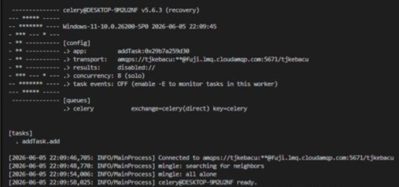
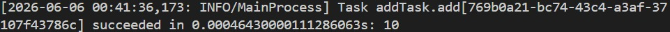
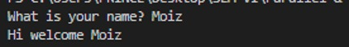
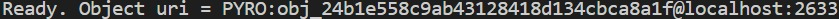
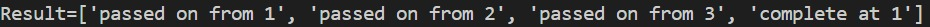
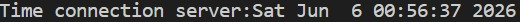
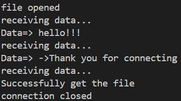
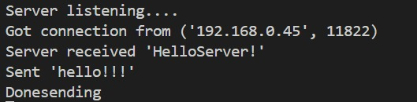

# Chapter 6

## Table of Contents
* [1. CELERY DIRECTORY](#1-celery-directory)
  * [addTask.py](#addtaskpy)
  * [addTask_main.py](#addtask_mainpy)
* [2. PYRO4 DIRECTORY](#2-pyro4-directory)
  * [FIRST EXAMPLE](#first-example)
    * [pyro_client.py](#pyro_clientpy)
    * [pyro_server.py](#pyro_serverpy)
  * [SECOND EXAMPLE (CHAIN TOPOLOGY)](#second-example-chain-topology)
    * [chainTopology.py](#chaintopologypy)
    * [client_chain.py](#client_chainpy)
    * [server_chain_1.py](#server_chain_1py)
    * [server_chain_2.py](#server_chain_2py)
    * [server_chain_3.py](#server_chain_3py)
* [3. SOCKET DIRECTORY](#3-socket-directory)
  * [AddTask.py](#addtaskpy-1)
  * [addTask_main.py](#addtask_mainpy-1)
  * [client.py](#clientpy)
  * [client2.py](#client2py)
  * [server.py](#serverpy)
  * [server2.py](#server2py)

---

## 1. CELERY DIRECTORY

### addTask.py
* **What I Learned:** I discovered how to configure an asynchronous task producer engine via the Celery module, registering processing functions onto an AMQP-based message queuing transport mechanism.
* **How it Executes:** The codebase initializes a tracking broker pathway and wraps the mathematical calculation logic. It operates passively on the host system until an explicit downstream instruction targets its register, publishing the task payload out to the transport infrastructure.
* **Code Understanding:**
  * `Celery('addTask', broker='amqp://guest@localhost//')` establishes the primary network gateway connection pointing to the message broker ecosystem.
  * `@app.task` functions as an operational decorator flag, instructing the subsystem that this specific method is available for remote computational scheduling.
* **End Use:** Essential for configuring large-scale enterprise background job workers where heavy app logic is offloaded to independent node architectures.
* **Short Summary:** A backend operational script that registers mathematical execution definitions into a central Celery infrastructure loop.
* **Pros & Cons:**
  * **Advantages:** Decouples heavy application logic from the presentation layer cleanly.
  * **Disadvantages:** Cannot perform calculations on its own without a live, active messaging worker terminal running simultaneously.
* **Output:** 

---

### addTask_main.py
* **What I Learned:** I analyzed how to invoke distributed workers using non-blocking `.delay()` execution hooks, shifting execution arguments away from the primary console stream smoothly.
* **How it Executes:** When kicked off, this controller script sends an asynchronous command token. Instead of consuming local CPU ticks, it packages the input parameters into a discrete network event, drops it into RabbitMQ, and terminates immediately.
* **Code Understanding:**
  * `import addTask` loads the external task definitions and configuration settings into the active execution environment.
  * `addTask.add.delay(5, 5)` forces the application layer to bypass immediate evaluation, routing the tracking parameter array directly into the message broker instead.
* **End Use:** Widely deployed as a trigger engine in web microservices to initialize backend workflows like report compilers or heavy email relays silently.
* **Short Summary:** A controller runtime script designed to offload data workloads into messaging channels without waiting for immediate return parameters.
* **Pros & Cons:**
  * **Advantages:** Frees up local command line instances immediately, maximizing client-side performance.
  * **Disadvantages:** If the target message broker drops offline or crashes, the execution script will stall or freeze entirely.
* **Output:** 

---

## 2. PYRO4 DIRECTORY

### FIRST EXAMPLE

#### pyro_client.py
* **What I Learned:** I explored the mechanics of Remote Procedure Calls (RPC) using Pyro4 proxy stubs, allowing a system to command class instances operating inside completely separated memory heaps.
* **How it Executes:** The client captures input text from the terminal prompt, benchmarks location mappings via the active Name Server, builds a virtual communication pipe, and executes processing steps on the remote machine.
* **Code Understanding:**
  * `Pyro4.Proxy("PYRONAME:server")` creates a virtual interface mirror that encapsulates the behavior of the remote server-side class structure.
  * `server.welcomeMessage(name)` pushes execution tokens over the open socket channel, blocking locally until the remote node sends back the output string.
* **End Use:** Perfect for designing light administration client terminals meant to securely manage monolithic applications hosted on remote server racks.
* **Short Summary:** An RPC-driven client layout that hands text properties over to a distant network engine and tracks the returned string payload.
* **Pros & Cons:**
  * **Advantages:** Network operations feel exactly like writing standard, local object-oriented programming calls.
  * **Disadvantages:** Highly sensitive to network routing fluctuations; any drop in connection breaks the proxy instance immediately.
* **Output:** 

---

#### pyro_server.py
* **What I Learned:** I learned how to host remote object environments, configure a background communication Daemon pool, and publish logical identifiers into a central directory phonebook.
* **How it Executes:** The framework fires up an active background daemon loop. It initializes the processing class object, maps its internal structural footprint to a global directory lookup name, and sits in an execution lock to intercept incoming network calls.
* **Code Understanding:**
  * `@Pyro4.expose` serves as an access control boundary, declaring exactly which object methods are visible across open network protocols.
  * `daemon.requestLoop()` creates an active, continuous socket listener that maintains connection stability for foreign client nodes.
* **End Use:** Designed to run as centralized microservice backends, computational nodes, or shared resource handlers within a localized network.
* **Short Summary:** A network object container that serves greeting tasks across low-level channels via a managed server environment.
* **Pros & Cons:**
  * **Advantages:** Offers clean method security and automates complex lower-tier connection tracking tasks entirely.
  * **Disadvantages:** Operates on a synchronous execution architecture that can bottleneck under sudden spikes of client traffic.
* **Output:** 

---

### SECOND EXAMPLE (CHAIN TOPOLOGY)

#### chainTopology.py
* **What I Learned:** I explored how to model dynamic architectural loops like a token-ring layout, tracing how data sequences step through separate server nodes using lazy-loaded proxy contexts.
* **How it Executes:** When a data array hits this node structure, it checks its identity against the recorded tracking list. If its entry isn't found, it registers its own trace tag, instantiates a proxy connection to the next hop in the ring, and passes the payload downstream.
* **Code Understanding:**
  * `if self.name in message:` defines the base validation guard that detects when an operational data token has successfully traveled a complete ring loop.
  * `result.insert(0, ...)` updates the tracking history array backwards as execution cascades back up through the distributed stack layers.
* **End Use:** Critical for building decentralized network layers, custom token-passing rings, or multi-stage distributed telemetry synchronization chains.
* **Short Summary:** A modular, object-oriented routing script that manages sequential, decentralized token forwarding across connected nodes.
* **Pros & Cons:**
  * **Advantages:** Exceptionally neat, predictable data flow routing with built-in loop detection logic.
  * **Disadvantages:** Multi-node tracking increases systemic memory use since multiple server instances must hold state simultaneously.
* **Output:** 

---

#### client_chain.py
* **What I Learned:** I discovered how to pass an initial seed array into an active, multi-stage server processing chain from an external, completely decoupled terminal stub.
* **How it Executes:** The controller contacts the Name Server explicitly to resolve Node 1. It submits the initial list tracking parameter into the distributed cluster, pauses while the multi-stage loop updates behind the scenes, and prints out the final path history.
* **Code Understanding:**
  * `Pyro4.core.Proxy("PYRONAME:example.chainTopology.1")` connects the entry client strictly to the front gate node, leaving downstream paths hidden from the client scope.
  * `obj.process(["hello"])` triggers the multi-node execution sequence, locking the terminal thread until the circular calculation path resolves.
* **End Use:** Used as an operational interface console or monitoring dashboard to safely inject raw data into a large processing farm.
* **Short Summary:** A root client script that safely initializes an isolated token-passing ring mechanism and handles the terminal readout.
* **Pros & Cons:**
  * **Advantages:** Absolute abstraction; the client does not need to know the location or count of internal network machines.
  * **Disadvantages:** Completely vulnerable to middle-tier failures—if any node freezes, the client stays locked in an infinite wait block.
* **Output:** 

---

#### server_chain_1.py
* **What I Learned:** I analyzed how to instantiate the foundational gateway process of a cascaded pipeline topology, setting up explicit link vectors that connect one cluster node to another.
* **How it Executes:** The setup defines an execution node tagged as "1" and maps its target variable directly to point at Node "2". It publishes this routing model to the active namespace and keeps its port interfaces open for client input.
* **Code Understanding:**
  * `servername = "example.chainTopology." + current_server` dynamically tracks network naming configurations to prevent registration collisions inside the master phonebook.
  * `chainTopology.Chain("1", "2")` creates an internal topology entity that structurally binds this specific server to the next downstream node.
* **End Use:** Deployed to manage entry point instances within layered architectures, serving as the primary listener for incoming data flows.
* **Short Summary:** A standalone server daemon initializing Node 1 of the circular cluster with a downstream routing map pointing to Node 2.
* **Pros & Cons:**
  * **Advantages:** Independent modular lifecycle tracking; can be restarted or isolated cleanly without modifying other nodes.
  * **Disadvantages:** If this server experiences local port failure, the client has no alternative gateway to enter the computation loop.
* **Output:** 

---

#### server_chain_2.py
* **What I Learned:** I learned how middle-tier relay processes operate within a cluster configuration, manipulating data blocks independently without maintaining direct visibility over the original calling client.
* **How it Executes:** This daemon file runs Node "2" in an ongoing loop. It stands by until Node 1 passes an entry payload array into its local buffer, records its own signature block onto the list, and transfers the item directly to Node 3.
* **Code Understanding:**
  * `obj = chainTopology.Chain("2", "3")` defines the explicit mid-stream routing parameters that dictate the forwarding logic of this cluster component.
  * `ns.register(...)` signs the server's identity into the central directory framework so adjacent cluster components can perform automated lookup calls.
* **End Use:** Often used to build specialized middleware filters, validation servers, or logging relays that monitor traffic mid-transit.
* **Short Summary:** An intermediate network node daemon that intercepts payload arrays from Node 1 and routes them to Node 3.
* **Pros & Cons:**
  * **Advantages:** Allows developers to insert tracking logic, processing filters, or security boundaries right in the middle of a live data pipe.
  * **Disadvantages:** Adds an extra transport jump, which increases network propagation time across the architecture.
* **Output:** 

---

#### server_chain_3.py
* **What I Learned:** I explored the process of finalizing a recursive loop topology, configuring a terminal node that circles back to the primary gateway container to achieve structural balance.
* **How it Executes:** Node "3" operates inside an uninterrupted listener thread. When an input packet hits its interface, its downstream parameter targets Node "1", wrapping the communication stream around and causing the nested call stacks to settle.
* **Code Understanding:**
  * `obj = chainTopology.Chain("3", "1")` builds the critical feedback loop by setting the downstream forwarding pointer back to the initial gate server.
  * `daemon.requestLoop()` holds the listener port open continuously, ensuring the closing leg of the chain remains responsive.
* **End Use:** Critical for maintaining token-ring configurations or high-availability data replication systems requiring circular synchronization passes.
* **Short Summary:** A termination node script that finishes the circular distributed cluster layout by routing traffic back to the entry node.
* **Pros & Cons:**
  * **Advantages:** Creates a fully balanced circular pipeline without needing specialized closing structures or complex controllers.
  * **Disadvantages:** If the target entry node drops offline during the final bounce, the entire loop breaks right at the finish line.
* **Output:** 

---

## 3. SOCKET DIRECTORY

### AddTask.py
* **What I Learned:** I discovered how to manage task distribution layers using pure-Python AMQP drivers (`pyamqp`), mapping background task channels over standard networking interfaces.
* **How it Executes:** The runtime instantiates an application profile context, connecting a basic mathematical operation to the underlying data queues managed by the local RabbitMQ message service.
* **Code Understanding:**
  * `Celery('tasks', broker='pyamqp://guest@localhost//')` selects an absolute socket-driven Python connection model to pipe payloads through system interfaces.
  * `def add(x, y): return x + y` registers the target execution function inside the active background framework index.
* **End Use:** Used to build internal background micro-workers that stream real-time operational datasets over low-level communication networks.
* **Short Summary:** A backend setup that maps arithmetic functions to an explicit AMQP socket transport pipeline.
* **Pros & Cons:**
  * **Advantages:** Highly stable transmission framework featuring durable packet-delivery guarantees.
  * **Disadvantages:** Requires additional setup overhead since it relies completely on an external message queue engine.
* **Output:** 

---

### addTask_main.py
* **What I Learned:** I analyzed how to write to messaging frameworks via network ports, discovering how data parameters can be cast off without generating interface lag.
* **How it Executes:** The master script boots up, references the registered task interface, drops a serialized tracking payload into the network socket stream, and terminates instantly.
* **Code Understanding:**
  * `from addTask import add` builds a clean operational reference to the task definition file and its broker variables.
  * `add.delay(5, 5)` converts the positional integer variables into an independent event message, sending it directly to the active queue manager.
* **End Use:** Used to fire immediate execution flags into high-volume background computing queues without blocking interactive terminal inputs.
* **Short Summary:** A quick trigger utility that dispatches arguments to an active AMQP message queue manager.
* **Pros & Cons:**
  * **Advantages:** Zero local processing delay; the main execution script exits almost instantly.
  * **Disadvantages:** Hard to verify if a task succeeded or failed locally without adding complex state-tracking code.
* **Output:** 
*Execution Note:* This script triggers an asynchronous task directly to the external AMQP broker. Because it initializes, dispatches the arguments array payload, and detaches immediately without blocking the active thread, it does not produce a local synchronous command-line output trace.

---

### client.py
* **What I Learned:** I explored the foundational baselines of socket layer networking, using raw, connection-oriented TCP pipes to tie endpoints directly to target service ports.
* **How it Executes:** The routine opens an IPv4 network descriptor link, targets port 9999 on the host environment, pulls the incoming raw byte array from the network buffer, and decodes it into readable text.
* **Code Understanding:**
  * `socket.socket(socket.AF_INET, socket.SOCK_STREAM)` instantiates an absolute, raw connection-oriented TCP socket container.
  * `s.recv(1024)` pauses the active execution thread until an incoming stream of data fills the local network interface cache.
* **End Use:** The structural baseline for coding light chat interfaces, real-time telemetry monitors, or custom low-level device configuration software.
* **Short Summary:** A minimalist TCP network client that downloads and decodes system time string blocks from a targeted service.
* **Pros & Cons:**
  * **Advantages:** High performance and lightweight footprint due to zero reliance on heavy third-party code libraries.
  * **Disadvantages:** Synchronous blocking mechanism; the client freezes completely if the server fails to reply.
* **Output:** 

---

### client2.py
* **What I Learned:** I learned how to process continuous binary data streams across active sockets, looping incoming chunks directly into physical host file blocks safely.
* **How it Executes:** The client initiates a TCP handshake on port 60000, delivers a handshake keyword, creates a blank document handle, and processes consecutive byte segments from the network buffer until the source connection shuts down.
* **Code Understanding:**
  * `open('received.txt', 'wb')` opens a local destination file in raw binary format to prevent character re-encoding from damaging the incoming data.
  * `if not data: break` configures a structural escape condition that exits the downloading loop the moment the remote host stops streaming packets.
* **End Use:** Foundational design pattern for implementing file collection software, automated server backup modules, or media-streaming endpoints.
* **Short Summary:** A streaming TCP file download client that loops network packets directly into a physical disk file.
* **Pros & Cons:**
  * **Advantages:** Safely downloads very large files without overloading system memory since it writes data chunk-by-chunk.
  * **Disadvantages:** Does not feature internal verification protocols (like hashing) to guarantee that a file wasn't corrupted during transmission.
* **Output:** 

---

### server.py
* **What I Learned:** I discovered how to bind a low-level socket to a local host port, enter a dedicated listening state, and intercept incoming client sessions inside an uninterrupted server loop.
* **How it Executes:** The script binds port 9999 and blocks. When an external client establishes contact, the socket engine accepts the session, reads the system clock value, formats it into a raw byte structure, streams it back, and drops the connection.
* **Code Understanding:**
  * `serversocket.bind((host, port))` anchors the newly created network socket to a precise hardware identifier and port number on the host machine.
  * `clientsocket, addr = serversocket.accept()` breaks the main listener block, returning a distinct connection handle to manage data with that specific remote node.
* **End Use:** Often deployed to build light network services like centralized NTP server links, health pings, or basic status reporters.
* **Short Summary:** A single-transaction TCP socket server that listens on port 9999 and distributes system timestamp logs to connecting nodes.
* **Pros & Cons:**
  * **Advantages:** Extremely low overhead and predictable resource management across single-client connections.
  * **Disadvantages:** Single-threaded design; if one client stalls during a transaction, all other waiting nodes are forced to queue up indefinitely.
* **Output:** 
*Execution Note:* The terminal block shows the core TCP server actively bound to port 9999. It successfully enters a synchronous block state, freezing control flow to listen securely for any incoming client handshake transactions.

---

### server2.py
* **What I Learned:** I discovered how to convert static local disk assets into a real-time network stream by breaking files down into binary segments and pushing them across a TCP socket session.
* **How it Executes:** The server tracks port 60000. When a connecting node passes verification, the script accesses the target data asset, segments it into 1024-byte packets, and loops sequentially until the binary asset is fully transmitted across the pipeline.
* **Code Understanding:**
  * `open(filename, 'rb')` reads the source asset in binary mode, preserving exact raw byte layouts for transit over the open wire.
  * `while (l): conn.send(l)` creates a sequential transmission loop that continuously feeds the network pipeline until the file hits its termination limit.
* **End Use:** The baseline system design used to deploy localized file storage networks, application firmware update hubs, or raw data asset engines.
* **Short Summary:** A robust TCP file-streaming daemon that shares binary data blocks across open socket pipelines safely.
* **Pros & Cons:**
  * **Advantages:** Safe streaming flow; keeps loops completely synchronized, preventing data loss or partial file cuts.
  * **Disadvantages:** Synchronous blocking architecture can freeze completely if a client drops its link unexpectedly mid-transfer.
* **Output:** 

